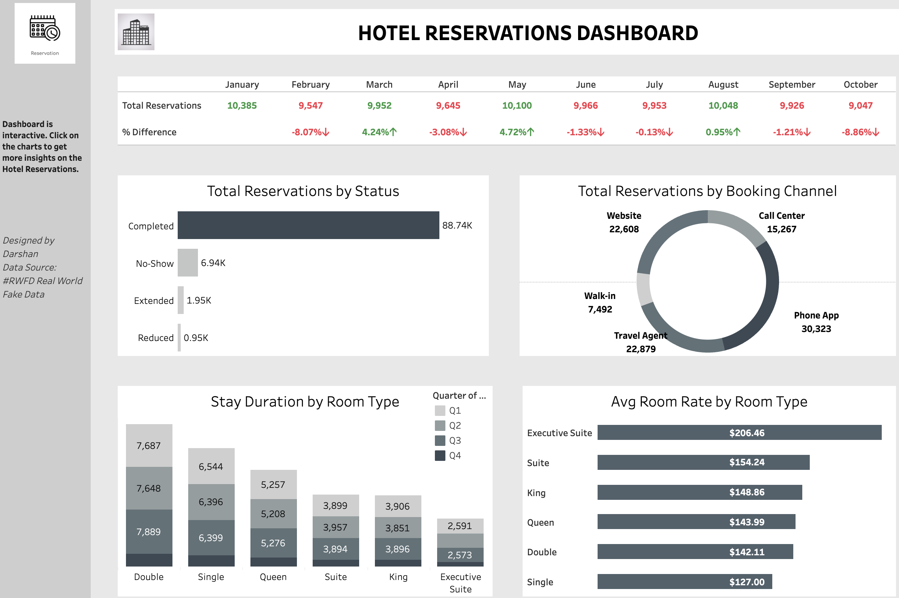

# 🏨 Hotel Reservations Dashboard

An interactive Tableau dashboard designed to analyze hotel booking patterns, track monthly trends, and uncover insights about reservation behavior, room types, and channel effectiveness.

🔗 **[Live Dashboard on Tableau](https://public.tableau.com/app/profile/darshan.lakhankiya/viz/HotelReservationsDashboard_17496980923560/HotelReservationsDashboard)**  
📊 **[Darshan's Tableau Profile](https://public.tableau.com/app/profile/darshan.lakhankiya)**

---

## 📌 Project Highlights

- **Monthly Reservation Trends**  
  Track total reservations per month and percentage changes to understand seasonality and booking volume fluctuations.

- **Reservation Status Overview**  
  Analyze bookings by status: Completed, No-Show, Extended, and Reduced.

- **Booking Channel Distribution**  
  Discover which platforms (Phone App, Website, Travel Agent, etc.) drive the most reservations.

- **Room Preferences & Duration**  
  Visualize room type popularity and length of stay across quarters.

- **Revenue Insights**  
  Compare average room rates by type to identify high-revenue segments like Executive Suites.

---

## 📈 Insights Derived

- Phone App and Travel Agents are leading channels in driving bookings.
- Double and Single rooms are the most preferred by customers.
- Executive Suites generate the highest average revenue per room.
- Booking volumes fluctuate monthly with noticeable seasonal drops.

---

## 💡 Tools Used

- Tableau Public for interactive visualization
- RWFD (Real World Fake Data) for simulated dataset
- Data preparation in Excel

---

## 📂 File Overview

- `9e6816df-2914-4b68-9bcc-7af8429c405a.JPG` — Dashboard Snapshot
- `README.md` — You’re here!

---

## 📬 Contact

Created by **Darshan Lakhankiya**  
For more dashboards and analytics, visit [my Tableau profile »](https://public.tableau.com/app/profile/darshan.lakhankiya)
