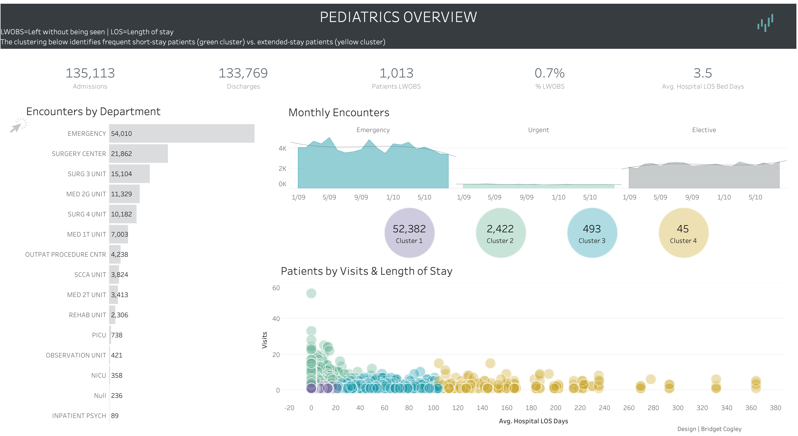

# 🏥 Pediatrics Overview Dashboard (Tableau)

This project presents an interactive Tableau dashboard designed to analyze **pediatric patient encounters** across various hospital departments. It leverages clustering to identify patterns in **patient length of stay (LOS)** and **encounter frequency**, offering actionable insights for healthcare management.

## 🔍 Project Highlights

- **135K+ Admissions** and **133K+ Discharges** visualized for trend analysis
- **Clustering insights**: Identify short-stay (green), medium-stay (blue), and extended-stay (yellow) patients
- **Departmental Breakdown**: Emergency, Surgery Units, Psych, Rehab, NICU, etc.
- **Key KPIs**: % of LWOBS (Left Without Being Seen), Avg. LOS Bed Days
- **Monthly Encounter Trends** segmented by Emergency, Urgent, and Elective categories
- **Interactive patient scatter**: Compare patient visits vs. average LOS by cluster group

## 📊 Dashboard Use Cases

- Track pediatric department workloads
- Recognize patterns in long-stay vs short-stay encounters
- Identify operational bottlenecks (e.g., high LWOBS %)
- Assist strategic planning in pediatric care services

## 📎 Live Dashboard

🔗 **[Explore the Tableau Dashboard](https://public.tableau.com/app/profile/darshan.lakhankiya/viz/VGContest_PediatricsOverview_BridgetCogley_17502964380420/Overview)**  
👤 **[View my Tableau Public Profile](https://public.tableau.com/app/profile/darshan.lakhankiya)**

---

> 📌 **Note**: Design credits to *Bridget Cogley*; dashboard reinterpreted and published by **Darshan Lakhankiya** for analytical exploration.
