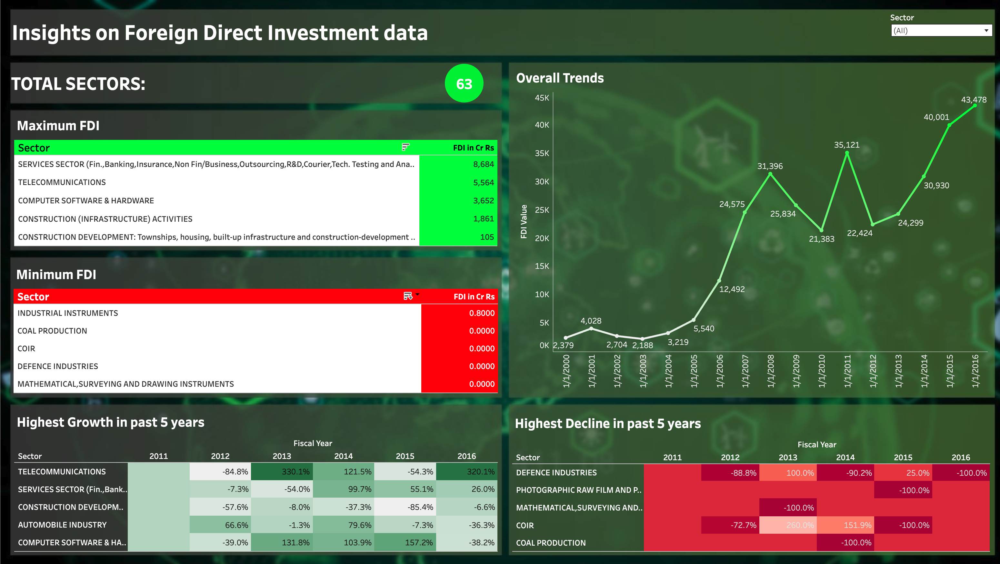

# 📊 Tableau Projects Portfolio by Darshan Lakhankiya

Welcome to my collection of **interactive Tableau dashboards** built to explore and present insights across diverse domains including HR analytics, customer service, automotive trends, foreign investment, and e-commerce performance.

---

## 🔍 Project Highlights

| Project Title | Key Insight Area | Preview | Dashboard Link |
|---------------|------------------|---------|----------------|
| **Amazon Sales Analysis** | Sales trends, profit channels, item revenue, global distribution |  | [View Dashboard](https://public.tableau.com/app/profile/darshan.lakhankiya/viz/AnalyzingAmazonSalesdata_17494105916340/AnalyzingAmazonSalesdata) |
| **Foreign Investment Analysis** | Sector trends, FDI forecasts, cluster segmentation |  | [Dashboard 1](https://public.tableau.com/app/profile/darshan.lakhankiya/viz/ForeignDirectInvestmentAnalytics_17494108627330/Dashboard1) • [Dashboard 2](https://public.tableau.com/app/profile/darshan.lakhankiya/viz/ForeignDirectInvestmentAnalytics_17494108627330/Dashboard2) |
| **Employee Data Analysis** | Workforce segmentation, satisfaction, travel patterns |  | [View Dashboard](https://public.tableau.com/app/profile/darshan.lakhankiya/viz/AnalyzingEmployeeTrends_17494120873740/Dashboard1) |
| **Call Center Insights** | Sentiment tracking, response SLA, channel and city breakdowns |  | [View Dashboard](https://public.tableau.com/app/profile/darshan.lakhankiya/viz/CallCenter_DataAnalysis_17494122924960/Dashboard1) |
| **Used Car Market Study** | Pricing, fuel impact, ownership and seller trends |  | [View Dashboard](https://public.tableau.com/app/profile/darshan.lakhankiya/viz/ExploringTrendsintheAutomotiveIndustry_17494124918290/Dashboard1) |

---

## 📁 Folder Structure

Each folder includes:
- 📷 Dashboard screenshot(s)
- 📄 `README.md` specific to the project
- 🔗 Live Tableau public link

---

## 🛠️ Tools Used
- Tableau Public
- Excel / CSV (Data Sources)
- Data Cleaning (Excel + Tableau)
- Color schemes for accessibility

---

## 🚀 Contact & Portfolio
🔗 [Tableau Public Profile](https://public.tableau.com/app/profile/darshan.lakhankiya)

Let me know if you'd like to collaborate or learn more!

---

> *Crafted with passion for insights that speak visually.*

