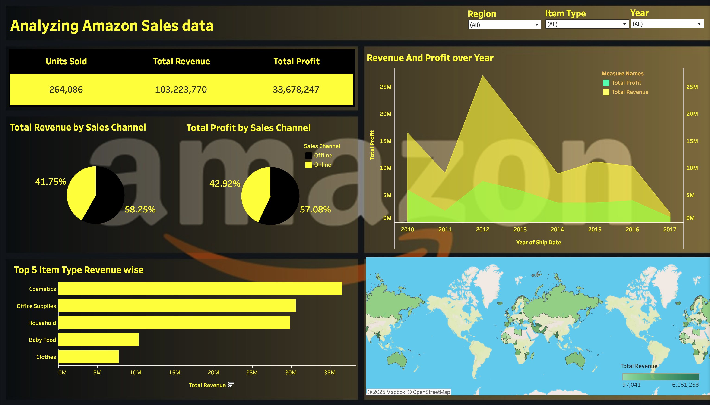

# 📊 Interactive Tableau Dashboards by Darshan Lakhankiya

Welcome to my Tableau dashboard portfolio. This repository contains interactive visualizations built to derive actionable insights from real-world datasets. Each dashboard focuses on a unique domain and uses thoughtful UI/UX design, meaningful KPIs, and engaging data storytelling.

---

## 🛍️ Amazon Sales Analytics Dashboard

**Project Link:** [View on Tableau Public](https://public.tableau.com/app/profile/darshan.lakhankiya/viz/AnalyzingAmazonSalesdata_17494105916340/AnalyzingAmazonSalesdata)

Analyze unit sales, total revenue, profit, and regional performance of Amazon product categories. Filter insights by:
- Region
- Product Type
- Sales Channel (Online vs Offline)

🔎 Includes:
- Pie charts, bar graphs, and geographical mapping
- Year-wise profit trends
- Top 5 revenue-generating item types

---

## 🌍 Foreign Direct Investment Analysis

**Project Link (Dashboard 1):** [FDI Insights Overview](https://public.tableau.com/app/profile/darshan.lakhankiya/viz/ForeignDirectInvestmentAnalytics_17494108627330/Dashboard1)  
**Project Link (Dashboard 2):** [Detailed Sector Analysis](https://public.tableau.com/app/profile/darshan.lakhankiya/viz/ForeignDirectInvestmentAnalytics_17494108627330/Dashboard2)

This dual-dashboard explores FDI trends across sectors from 2000–2018 with:

- 📈 Forecasting Trends
- 📊 Sector-wise Treemaps
- 🔥 Growth & Decline Heatmaps
- 🧠 Cluster Analysis and Timeline Charts

Perfect for economic planning, international strategy, and investment insights.

---

## 📎 About Me

I'm Darshan Lakhankiya, a data analyst passionate about visual storytelling and business insights.  
📍 [Tableau Profile](https://public.tableau.com/app/profile/darshan.lakhankiya)

---

> ⭐ Star this repo if you like the dashboards or find them insightful!