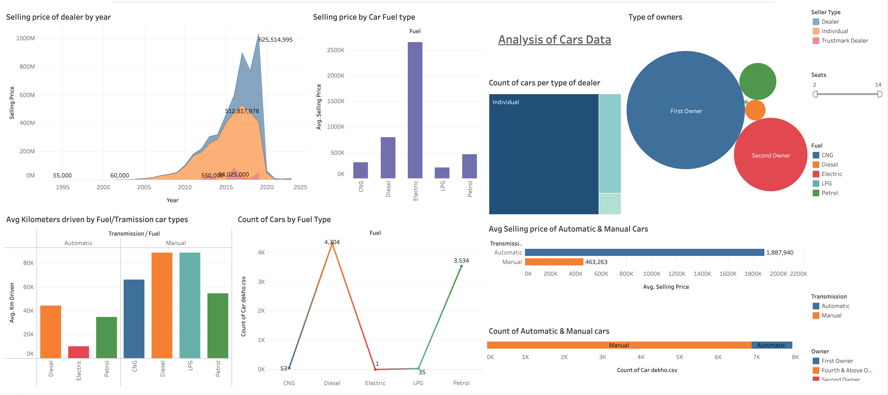

# 🚗 Exploring Trends in the Automotive Industry

🔗 **[View Interactive Dashboard in Tableau](https://public.tableau.com/app/profile/darshan.lakhankiya/viz/ExploringTrendsintheAutomotiveIndustry_17494124918290/Dashboard1)**

## 📌 Project Description

This project involved developing an interactive Tableau dashboard to explore and analyze trends in the used car market. By integrating multiple views and filters, the dashboard provides rich insights across vehicle types, sellers, pricing patterns, and more.

## 🎯 Objectives

- Understand **sales trends over time**.
- Compare **pricing and mileage** by transmission and fuel type.
- Visualize **dealer types** and **ownership patterns**.
- Forecast price movement using historical data.
- Support **inventory, pricing, and marketing** strategies.

---

## 📊 Key Features

- 📈 **Selling Price by Year**: Shows how average selling prices trend across time.
- ⛽ **Fuel Type Insights**: Compare average selling price and volume across CNG, Petrol, Diesel, Electric, etc.
- 🔄 **Transmission Analysis**: Average selling price and count split by automatic vs manual.
- 👤 **Ownership Breakdown**: Bubble chart of first, second, and higher ownership types.
- 🧭 **Dealer Insights**: Tree map analysis for types of dealers.
- 🔍 **Mileage Analysis**: Average kilometers driven by fuel + transmission combination.
- 🧮 **Filters & Controls**: Filter by seat count, fuel type, owner type, and transmission.

---

## 💡 Value and Impact

This dashboard helps auto dealers, analysts, and business strategists to:

- Spot shifts in **consumer preferences** (e.g., rise of automatic or electric cars)
- Discover **high-performing sales segments**
- Make informed decisions about **inventory planning and pricing**
- Identify **opportunities for marketing campaigns** based on data

---

## 📎 Tools Used

- **Tableau Public** – For interactive dashboard development and visualization
- **CSV data** – Used car listings dataset

---

## 🧾 Credits

📍 **Designed by:** Darshan Lakhankiya  
📊 **Tableau Public Portfolio:** [Visit Here](https://public.tableau.com/app/profile/darshan.lakhankiya)

---

> 📢 _Note: This dataset is anonymized and used strictly for educational purposes._

