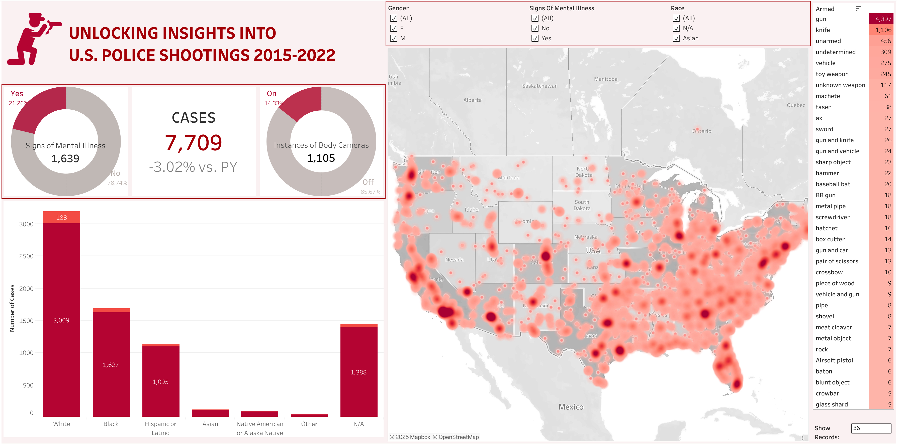

# 🚨 U.S. Police Shootings Analysis Dashboard (2015–2022)

📊 [View Live Dashboard on Tableau Public](https://public.tableau.com/app/profile/darshan.lakhankiya/viz/U_S_PoliceShootingsAnalysisDashboard_17504749187690/Dashboard)  
🔗 [Visit My Tableau Profile](https://public.tableau.com/app/profile/darshan.lakhankiya)

## 📌 Overview
This project presents a comprehensive Tableau dashboard visualizing police shootings across the United States from 2015 to 2022. The goal is to uncover insights about the distribution, demographics, mental health indicators, and weapon usage involved in these incidents.

## 📂 Key Features
- **Total Cases Analyzed:** 7,709 incidents  
- **Mental Health Impact:** Breakdown of cases involving signs of mental illness  
- **Body Camera Usage:** Statistics on whether body cameras were in use  
- **Geospatial Heatmap:** Visual clustering of shootings across U.S. regions  
- **Demographics:** Gender and race-based distribution of victims  
- **Weapon Analysis:** Identification of weapons involved, including guns, knives, and unarmed individuals

## 📊 Visual Components
- **Heatmap** of shooting incidents across the U.S.
- **Donut Charts** showing mental illness indicators and body camera presence
- **Bar Charts** showing racial disparities and weapon type frequency
- **Interactive Filters** for gender, race, mental illness status, and more

## 🧠 Insights
- Majority of victims were male.
- A significant number of cases involved mental illness indicators.
- Guns were the most common weapon involved.
- Body cameras were present in less than 15% of incidents.

## 📦 Dataset Source
The data for this analysis was sourced from **The Washington Post’s Police Shootings Database**, a publicly maintained and regularly updated dataset covering police-involved fatal shootings.
