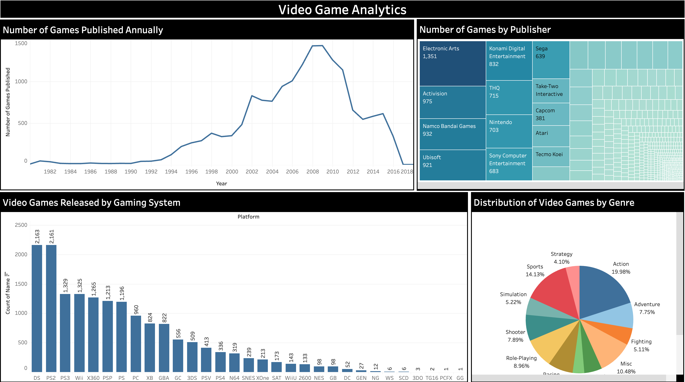

# 🎮 Video Game Analytics Dashboard  

## 📌 Project Overview  
This interactive **Video Game Analytics Dashboard** is built in **Power BI** to explore and visualize insights about the video game industry. It provides a clear and intuitive view of publishing trends, top publishers, gaming platforms, and genre distributions.  

The dashboard helps answer key questions:  
- How many games were published over the years?  
- Which publishers dominate the market?  
- Which gaming systems released the most titles?  
- What are the most popular game genres?  

---

## 📊 Key Features  

### 1. **Number of Games Published Annually**  
- Line chart showing game release trends since the 1980s.  
- Peak publishing activity around **2008**, followed by a decline.  

### 2. **Games by Publisher**  
- Treemap visualization of top publishers.  
- Leading publishers include **Electronic Arts (1,351)**, **Activision (975)**, and **Namco Bandai Games (932)**.  

### 3. **Games by Gaming System**  
- Bar chart comparing game counts by platform.  
- **Nintendo DS (2,163)** and **PlayStation 2 (2,161)** lead the list.  

### 4. **Distribution by Genre**  
- Pie chart showing game distribution by genre.  
- Top genres: **Action (19.98%)**, **Sports (14.13%)**, **Role-Playing (8.96%)**.  

---

## 🛠 Tools & Technologies  
- **Visualization Tool:** Power BI  
- **Dataset:** Publicly available video game dataset  
- **Skills Applied:** Data transformation, visualization design, analytical storytelling  

---

## 🚀 How to Access  
1. Open the dashboard here: [Video Game Analytics Dashboard](https://public.tableau.com/app/profile/darshan.lakhankiya/viz/video_game_dashboard_17556456255090/Dashboard2)  
2. Navigate through charts to explore insights.  
3. Use filters (if available) to drill into publishers, years, or platforms.  

---

## 📸 Dashboard Preview  

 

---

## 👤 Author  
**Darshan Lakhankiya**  
- 📊 Tableau Portfolio: [View Here](https://public.tableau.com/app/profile/darshan.lakhankiya/vizzes)  
- 💼 GitHub: [darshandl](https://github.com/darshandl)  

---

## 📌 Future Enhancements  
- Add regional sales breakdown for games.  
- Highlight best-selling titles per genre and platform.  
- Integrate interactive filters for deeper drill-down analysis.  
